# Quick Start Guide: Option 1

This guide is for users that will be extracting the technical metadata and digital assets for the first time, nothing has been ingested into Preservica or another comparable repository at this time.

**Beginning Set-Up**
1. Ensure the appropriate level of preservation needed for the project.
2. Confirm computer workstation is set-up with the appropriate tool: Python (and its dependencies and packages), FTK Imager (if using a PC), and Preservica log in.
3. Unless impossible to use with the source device, connect the write-blocker to the computer workstation in the following order:
   - Connect the write-blocker to the source device (USB, SD Card, HDD, folder, etc.).
    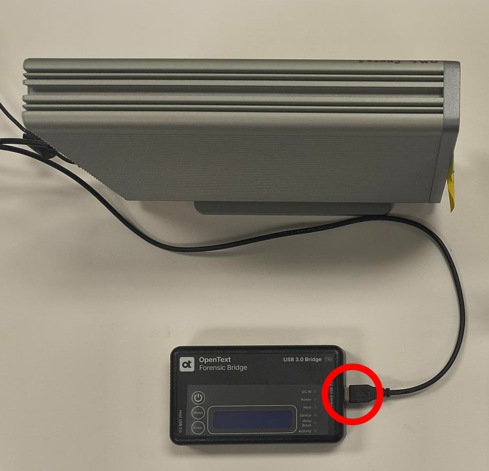
   - Connect the computer workstation to the write-blocker.
    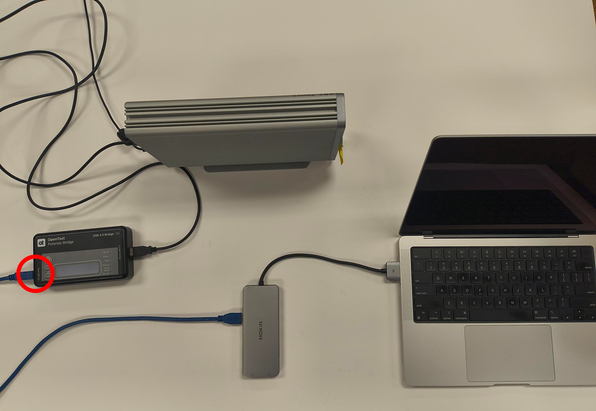
   - Turn on the write-blocker.
    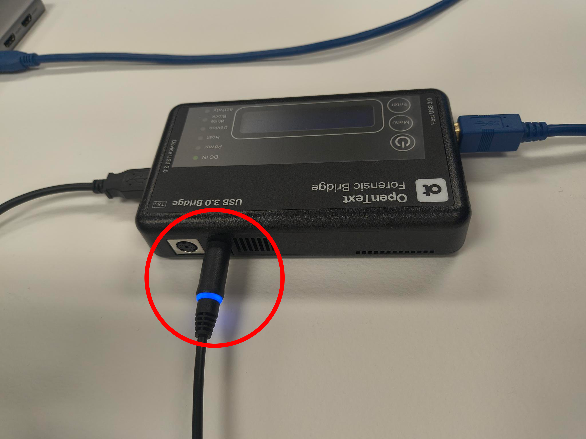

**WARNING: Follow the steps in the exact order to avoid device malfunction.**

**Note:** If the write-blocker is not available or is not compatible with the source device, you can proceed with the workflow per the archivist's discretion, but **extreme care must be taken not to write to the source device**.

4. Open the tool by navigating to the OMCSERV network drive and opening the Archival Procedure folder and double-clicking on the **archival-metadata-utility-tool.py**.

 
 
 *Image: OMC local network drive containing utility tool*

**Using the tool**

5. Select Option 1: Extract Metadata from a Folder (No Existing Entity Ref IDs) on the window

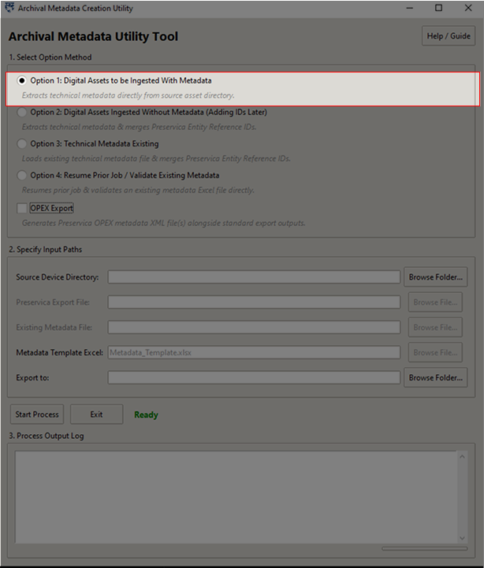

*Image: Archive Metadata Utility Tool Window*
   
6.
   - Click **Browse Folder** to select the source device. This can be a USB, SD Card, HDD, folder, CD drive, etc.
   - Click **Browse Folder** to select the **Export to** location for both metadata files ("source-device-name_Metadata" and "DC").

**Note:** *It is recommended to save the metadata files to a local computer workstation or established network drive location, **NOT** on the source device.*

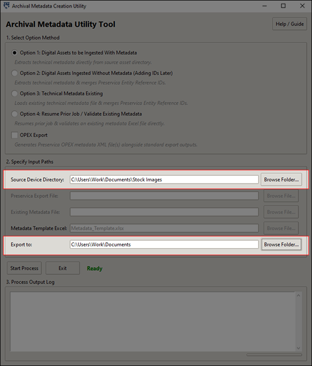

*Image: Archive Metadata Utility Tool Window Selecting Paths*
   
7. Click the *Start Process* button. The tool will scan your specified source device to extract technical information and create a new Excel file in your export folder with the name of the source device and '_Metadata' attached to the name.

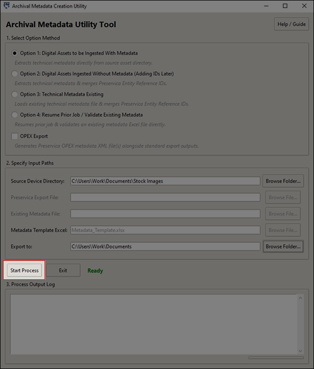

*Image: Archive Metadata Utility Tool Start Process*
   
**Manual Entry**

8. When the tool pauses, click the **Open File** button to open the newly created Excel file. Fill in the missing descriptive information in the "DC" tab.

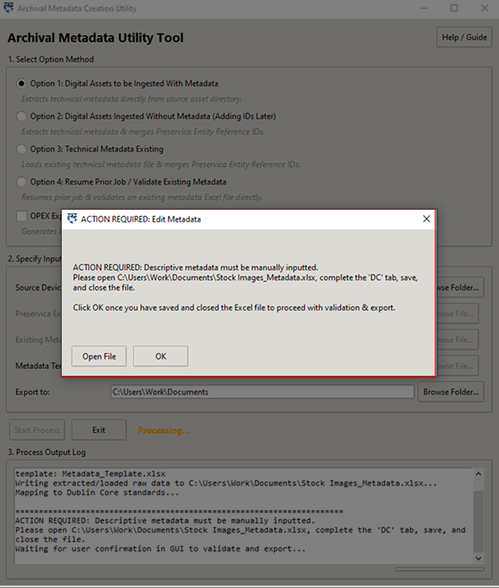

*Image: Archive Metadata Utility Tool Window*

*Image: Action Required: Edit Metadata Pop-up*

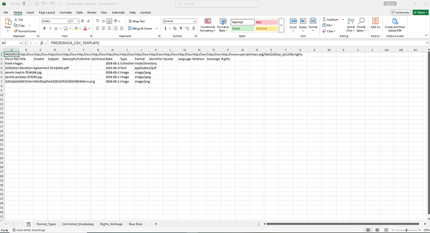

*Image: Metadata Working File Excel*
   
9. Save and close the Excel file, then click OK in the tool to resume.

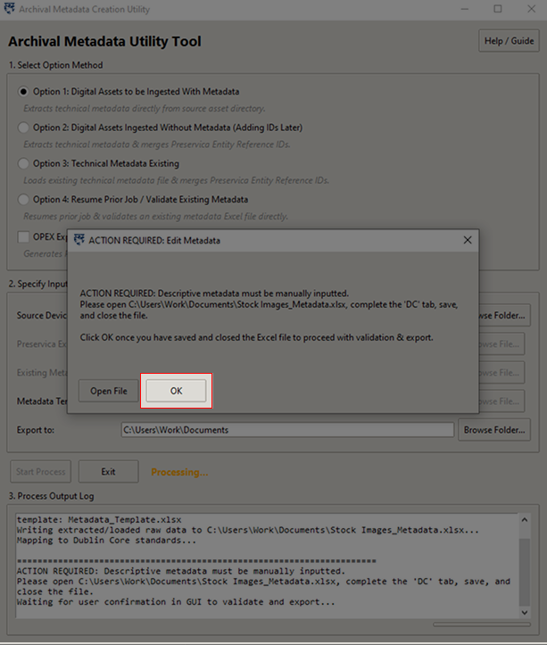

*Image: Action Required: Edit Metadata Pop-up*
   
**Finalize Validation**

10. The tool will check your entries for typos and missing fields, then save the final completed `DC.csv` and Excel files in your export folder.

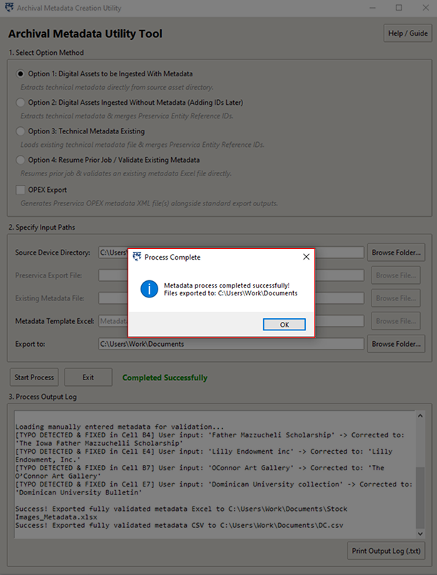

*Image: Process Complete Window*

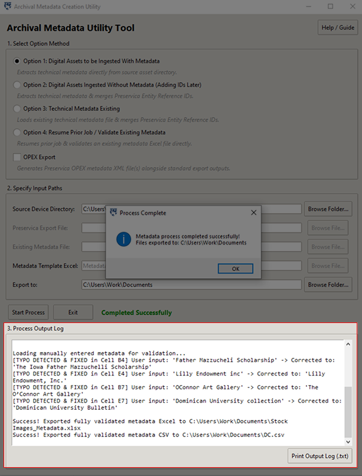

*Image: Process Complete Window*

    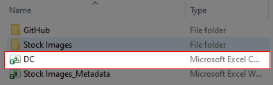

*Image: DC File Export*

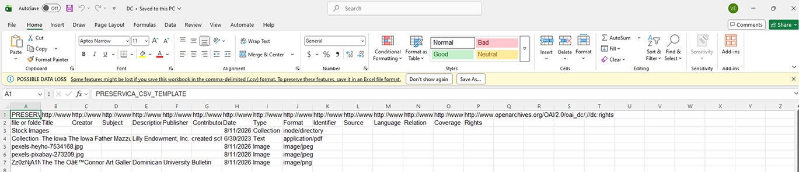

*Image: DC File*

**Ingesting into Preservica**

11. Create a zip file of the assets with the `DC.csv` file inside of it for ingest into Preservica. The `DC.csv` file must be in the root directory of the zip file.

**Note:** If file is over 50GB, split it into smaller files or use OPEX to ingest into Preservica.

12. Log onto Preservica and navigate to the **New Gen** website.

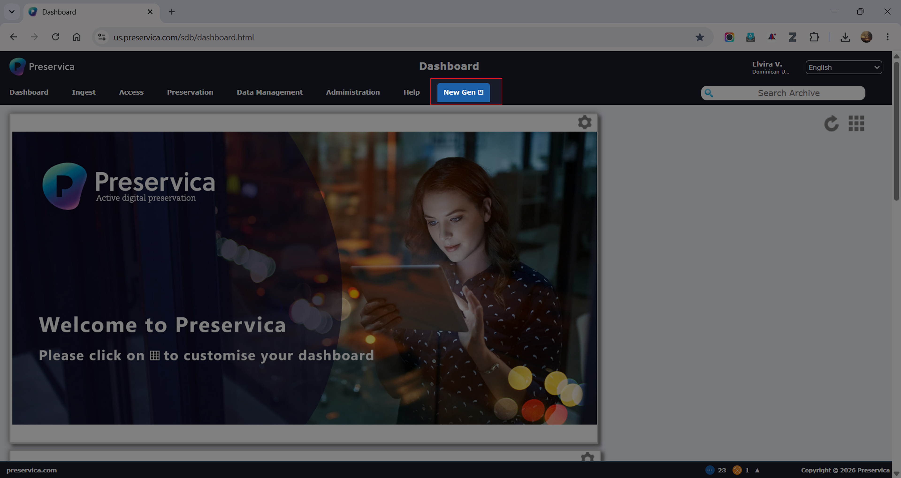

*Image: Preservica Login Classic Page*

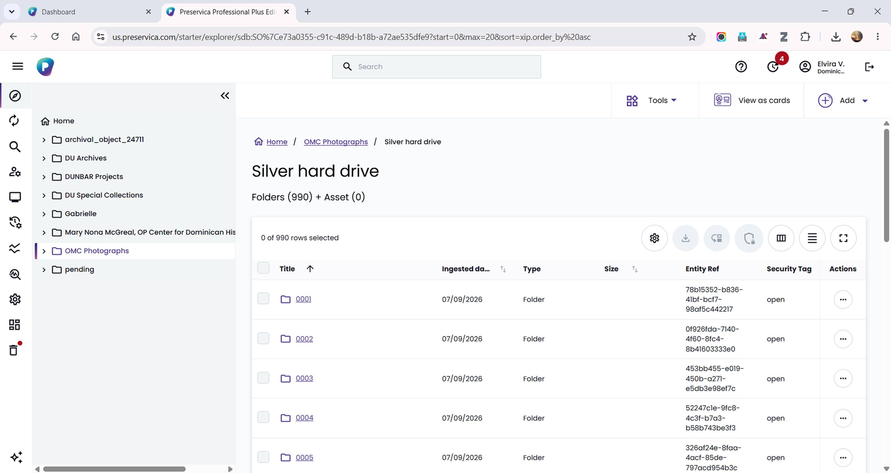

*Image: Preservica New Gen Page*

13. Click **Add** on the top right corner and select **Upload a folder with metadata** to upload the zip folder containing the digital assets and `DC.csv` file to the Preservica account.

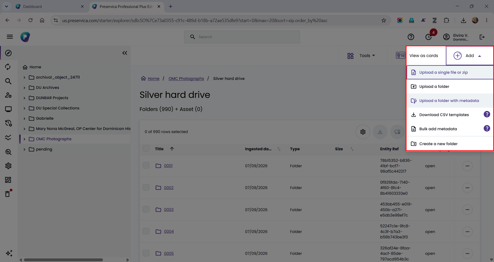

*Image: Upload to folder and metadata into Preservica*

14. Once uploaded, the digital assets and their descriptive metadata will be available in Preservica.