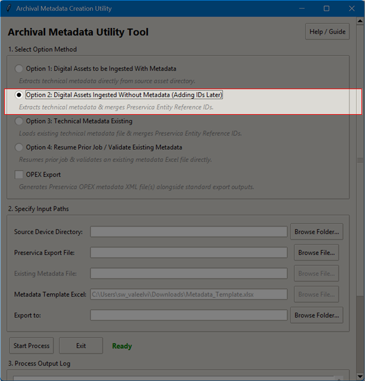
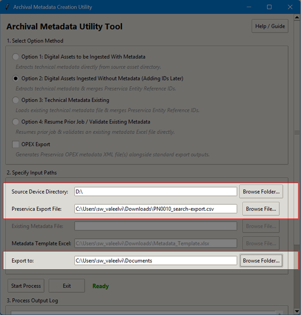
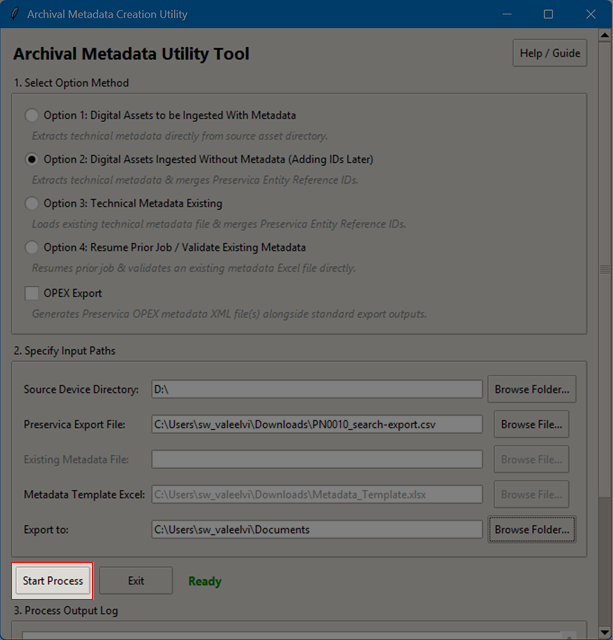

# Quick Start Guide: Option 2

This guide is for users that will be extracting the technical metadata and digital assets for the first time, where nothing has been ingested into Preservica or another comparable repository at this time.

### **Beginning Setup**
1. Ensure the appropriate level of preservation needed for the project.
2. Confirm computer workstation is set up with the appropriate tool: Python (its dependencies and packages), FTK Imager (if using a PC), and Preservica login.
3. Unless impossible to use with the source device, connect the write-blocker to the computer workstation in the following order:
   - Connect the write-blocker to the source device (USB, SD Card, HDD, folder, etc.).
    
   - Connect the computer workstation to the write-blocker.
    
   - Turn on the write-blocker.
    

**WARNING: Follow the steps in the exact order to avoid device malfunction.**

**Note:** If the write-blocker is not available or is not compatible with the source device, you can proceed with the workflow per the archivist's discretion, but **extreme care must be taken not to write to the source device**.

4. Open the tool by navigating to the *OMCSERV* network drive and opening the *Digital Assets Procedure* folder and double-clicking on the **archival-metadata-utility-tool.py**.

 
 
 *Image: OMC local network drive containing utility tool*

---
### **Using the tool**

5. Select Option 2: Digital Assets Ingested Without Metadata (Adding IDs Later)

*Image: Archive Metadata Utility Tool Window*
   
6. Enter the folder path containing your digital files, the file path for your Preservica CSV export, and the folder path where you want to save your new exports.

   1. Click **Browse Folder** to select the source device.
   2. Click **Browse File** to select the csv exported from Preservica containing the **Entity Ref ID**.
   3. Click **Browse Folder** to select the **Export to** location for both metadata files.

*Image: Archive Metadata Utility Tool Window Selecting Paths*

7. Click the **Start Process** button. The tool will scan your folder, match your files with their Preservica IDs, and create a new Excel file in your export folder.

*Image: Archive Metadata Utility Tool Window Start Process*

---
   
### **Manual Entry**

8. When the tool pauses, click the **Open File** button to open the newly created Excel file. Fill in the missing descriptive information in the "DC" tab.

*Image: Metadata Working File Excel*
   
9. Save and close the Excel file, then click OK in the tool to resume.
   
### **Finalize Validation**

10. The tool will check your entries for typos and missing fields, then save the final completed `DC.csv` and Excel files in your export folder.

*Image: DC File*

### **Ingesting into Preservica**

11. Log onto Preservica and navigate to the **New Gen** website.

*Image: Preservica Login Classic Page*

*Image: Preservica New Gen Page*

12. Navigate to the **root folder** of the digital assets in Preservica. Click **Add** on the top right corner and select **Bulk add metadata** to upload the `DC.csv` file to the Preservica account.

*Image: Upload to folder and metadata into Preservica*

13. Once uploaded, the digital assets and their descriptive metadata will be available in Preservica.