# Quick Start Guide: Option 4

This guide is for users that will be extracting the technical metadata and digital assets for the first time, where nothing has been ingested into Preservica or another comparable repository at this time.

### **Beginning Setup**
1. Ensure the appropriate level of preservation needed for the project.
2. Confirm computer workstation is set up with the appropriate tool: Python (its dependencies and packages), FTK Imager (if using a PC), and Preservica login.
3. Unless impossible to use with the source device, connect the write-blocker to the computer workstation in the following order:
   - Connect the write-blocker to the source device (USB, SD Card, HDD, folder, etc.).
    
   - Connect the computer workstation to the write-blocker.
    
   - Turn on the write-blocker.
    

**WARNING: Follow the steps in the exact order to avoid device malfunction.**

**Note:** If the write-blocker is not available or is not compatible with the source device, you can proceed with the workflow per the archivist's discretion, but **extreme care must be taken not to write to the source device**.

4. Open the tool by navigating to the *OMCSERV* network drive and opening the *Archival Procedure* folder and double-clicking on the **archival-metadata-utility-tool.py**.

 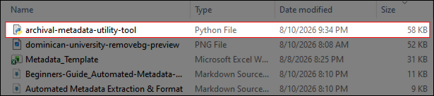
 
 *Image: OMC local network drive containing utility tool*

### **Using the tool**

5. Select Option 4: Resume Prior Job/Validate Existing Metadata on the window.

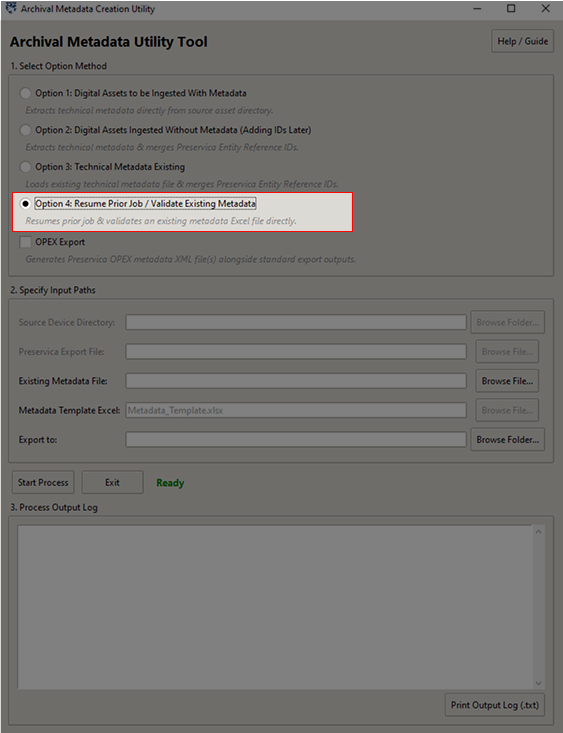

*Image: Archive Metadata Utility Tool Window*

6. - Click **Browse File** to select the **Existing Metadata** file.
   - Click **Browse Folder** to select the **Export to** location for both metadata files.

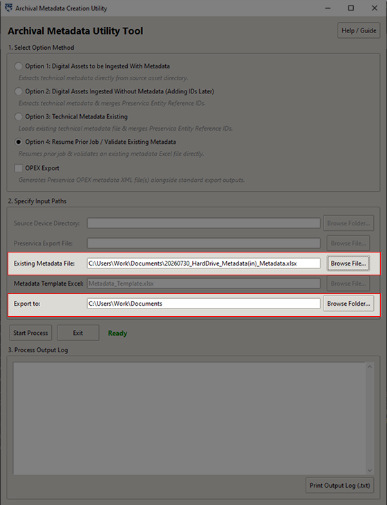

*Image: Archive Metadata Utility Tool Window Selecting Paths*

**Note:** *It is recommended to save the metadata files to a local computer workstation or established network drive location, **NOT** on the source device.*

7. Click the **Start Process** button. The tool will scan your files.
 
## Manual Entry

8. When the tool pauses, click the **Open File** button to open the Excel file. Fill in the missing descriptive information in the "DC" tab.

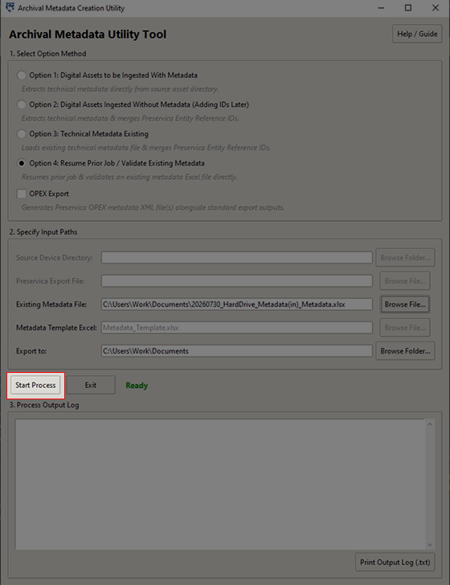

*Image: Archive Metadata Utility Tool Window*

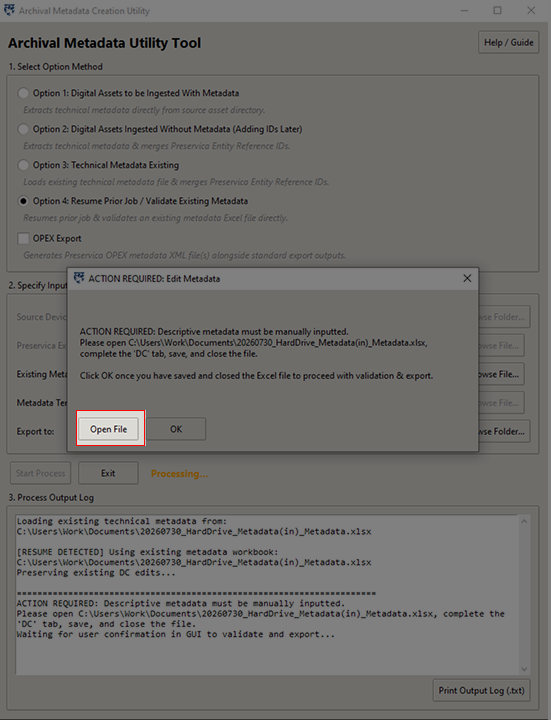

*Image: Action Required: Edit Metadata Pop-up*

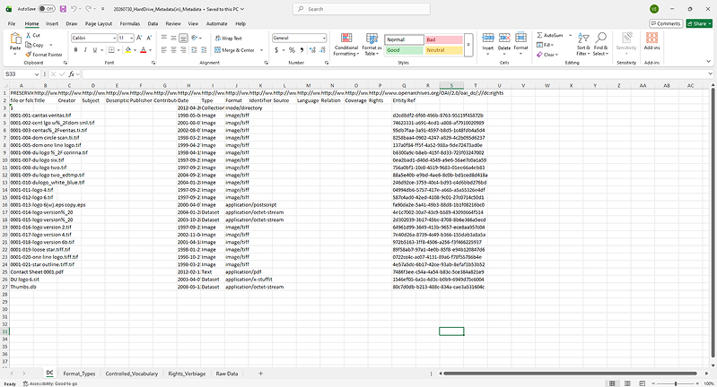

*Image: Metadata Working File Excel*

9. Save and close the Excel file, then click OK in the tool to resume.

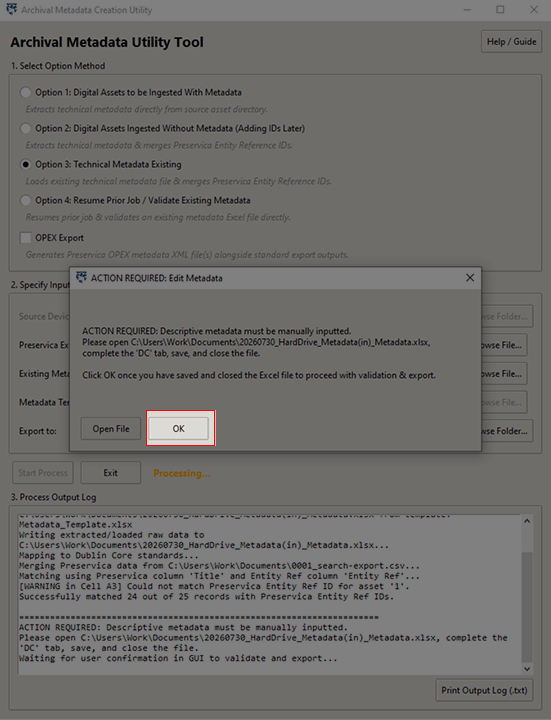

*Image: Action Required: Edit Metadata Pop-up*

6. **Finalize:** The tool will check your entries for typos and missing fields, then save the final completed `DC.csv` and Excel files in your export folder.

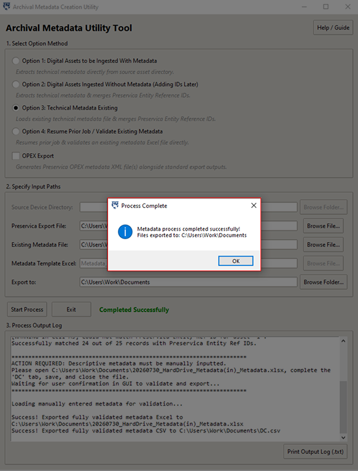

*Image: Process Complete Window*

**Note** If you need to review the changes or errors made to the `DC.csv` and Excel files, you can read the process log window or download a copy for your records.

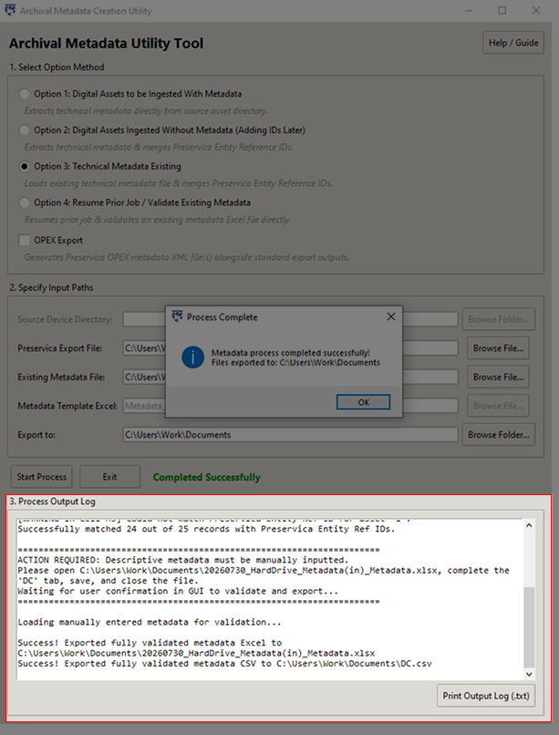

*Image: Process Complete Window*

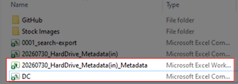

*Image: DC File Export*

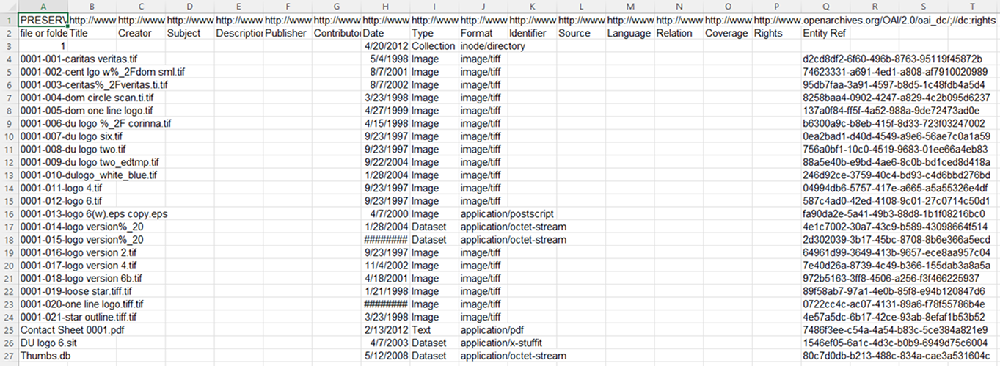

*Image: DC File*

### **Ingesting into Preservica**

11. Log onto Preservica and navigate to the **New Gen** website.

*Image: Preservica Login Classic Page*

*Image: Preservica New Gen Page*

12. Click **Add** on the top right corner and select **Upload a file** to upload the zip folder containing the digital assets and `DC.csv` file to the Preservica account.

*Image: Upload to folder and metadata into Preservica*

13. Once uploaded, the digital assets will have a viewable DC metadata section in Preservica.

*Image: Preservica DC metadata*